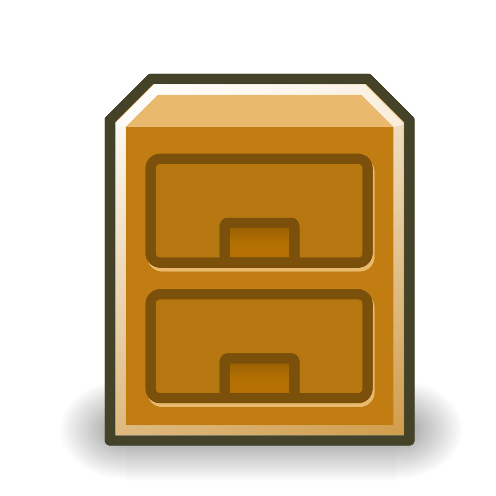

<p align="center">
  
</p>
	<h2 align="center">File Manager</h2>
	<p align="center">A File Manager built with Laravel </p>
<div>


<div align="center">


</div>

---

## Requirements

File Manager requires a Docker, Docker Compose, Composer that contains the necessary libraries to initialize a Laravel project

* [Docker](https://www.docker.com/)
* [Docker Compose](https://docs.docker.com/compose/)
* [Composer](https://getcomposer.org/)

## Usage
You just need to clone the repository with git
Use `composer install` in the root of the project to install the composer.json packages.

To install Composer dependencies for existing applications without wanting to install it on your computer person al you can use the following command
in the project root.

```yml
docker run --rm
    -u "$(id -u):$(id -g)" \
    -v $(pwd):/var/www/html \
    -w /var/www/html \
    laravelsail/php81-composer:latest \
    composer install --ignore-platform-reqs
```

Once this is done copy the **.env.example** file and rename it to **.env** setting all the environment variables needed to create the container below.

Using the command `./vendor/bin/sail up`, sail will take care of building the necessary containers with the help of the **docker-compose.yml** file.

For create models if you don't have php installed, attach the php container to a bash shell and run the command
`php artisan migrate`.


Once all this is done access localhost.

---
